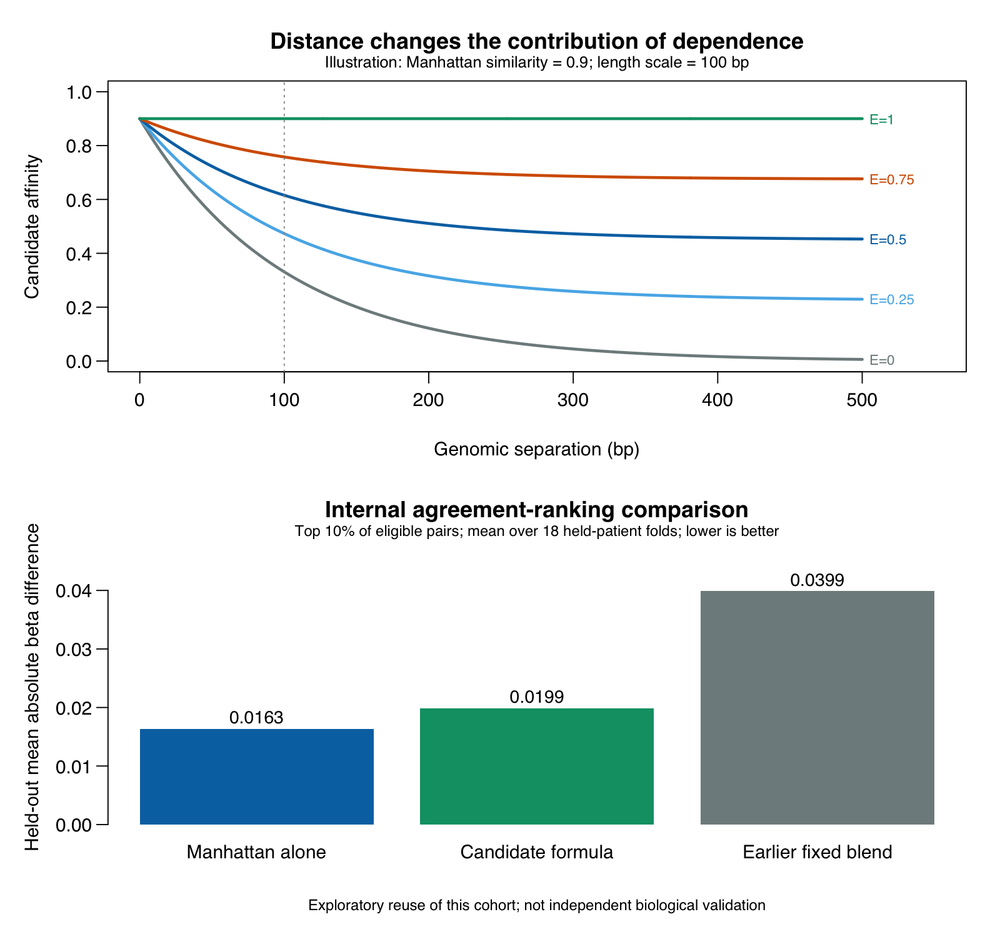

# A proposed similarity formula using Manhattan agreement, dependence and genomic distance

2026-09-29. This is a concrete, implemented candidate for item 5. It is a
composite affinity with an explicit interpretation. Its novelty and biological
usefulness have not been established.

The subsequent [novelty assessment](Item5_Novelty_Assessment.md) identifies
the exact aggregation structure as a product combined with the established
probabilistic sum: `S*[w+(1-w)*E] = S*(w+E-w*E)`. The gate therefore does not
establish new mathematical machinery; any contribution would require a
demonstrated application-specific benefit or other distinct property.

## Formula

For CpGs i and j, let x and y be their beta profiles over the same n observed
patients, and let g be their genomic separation in base pairs. Define

\[
S=1-\frac{1}{n}\sum_{k=1}^{n}|x_k-y_k|,
\qquad q=\operatorname{dCor}(x,y)^2,
\]

\[
q_0=\mathbb E_\pi[q(x,y_\pi)],
\qquad E=\left[\frac{q-q_0}{1-q_0}\right]_+,
\qquad w=\exp(-g/\ell),
\]

where [z]+ means max(0,z), and pi permutes patient correspondence while keeping
the two observed marginal profiles fixed. The proposed score is

\[
\boxed{F_{ij}=S_{ij}\left[w_{ij}+(1-w_{ij})E_{ij}\right].}
\]

**Interpretation:** absolute methylation agreement supplies the base score.
Nearby sites retain much of that agreement credit. As sites become farther
apart, retaining the score requires more dependence above the shuffled-pairing
baseline. Dependence cannot compensate for poor absolute agreement, since
F never exceeds S.

The initial scale is ell=100 bp, with 50 and 200 bp examined separately. It is
a design choice, not a fitted biological correlation length. At a separation
of ell, w=e^-1≈0.368. This w is a deterministic proximity weight, not an
estimated probability of sharing a regulatory region.

If either profile is constant, dCor is undefined. We assign **zero dependence
credit E**, retain the undefined-statistic flag, and obtain F=wS. This does
not assign a zero correlation to constant profiles. When q0 is numerically
one (always at n=2), the same zero-credit convention applies because the
permutation distribution cannot discriminate pairings. This pilot uses n=18
for full scores and n=17 for training folds.

## Computing the permutation baseline exactly

Let a_kl=|x_k-x_l| and b_kl=|y_k-y_l|. Double-center each distance matrix:

\[
A_{kl}=a_{kl}-\bar a_{k\cdot}-\bar a_{\cdot l}+\bar a_{\cdot\cdot},
\quad
B_{kl}=b_{kl}-\bar b_{k\cdot}-\bar b_{\cdot l}+\bar b_{\cdot\cdot}.
\]

For ordinary sample distance correlation squared,

\[
q=\frac{\sum_{kl}A_{kl}B_{kl}}
{\sqrt{\sum_{kl}A_{kl}^2\sum_{kl}B_{kl}^2}},
\quad
\boxed{q_0=\frac{\operatorname{tr}(A)\operatorname{tr}(B)}
{(n-1)\sqrt{\sum_{kl}A_{kl}^2\sum_{kl}B_{kl}^2}}.}
\]

Therefore no Monte Carlo permutations are needed merely to calculate q0.
The denominator is unchanged under permutation. The expected contribution
from diagonal products is tr(A)tr(B)/n. Because centered matrices have zero
row sums, each off-diagonal total is minus its trace; the expected
off-diagonal contribution is tr(A)tr(B)/[n(n-1)]. Adding both gives the
displayed expression.

This expectation is established mathematics: it is the RV permutation-mean
formula of [Josse, Pagès and Husson (2008)](https://doi.org/10.1016/j.csda.2008.06.012),
applied to the distance-induced matrices -A and -B. The exact expression was
checked in the [author-posted full text, pp. 85–86](https://www.researchgate.net/publication/255569780_Testing_the_signiflcance_of_the_RV_coefficient).
Normalized centered matrix alignment also has extensive prior art, including
[Cortes, Mohri and Rostamizadeh (2012)](https://www.jmlr.org/papers/volume13/cortes12a/cortes12a.pdf).
We do not claim a new dCor, a new null expectation, or a new kernel-alignment
principle. The construction here is the proposed combination with agreement
and genomic proximity. The methylation context for spatial modeling includes
[Nustad et al. (2022)](https://doi.org/10.1093/bioinformatics/btab774);
the [earlier literature review](Item5_Manhattan_Spatial_PriorArt.md) documents
Manhattan-based and multi-factor methylation methods.

The signed quantity (q-q0)/(1-q0) has exactly zero conditional permutation
mean. **Its positive part E does not.** E is excess-dependence credit, not an
unbiased estimator, significance level, or probability. Finite-sample null
centering does not by itself calibrate the full score F.

## Mathematical behavior

For beta values in [0,1], ell>0 and g>=0:

- The score is symmetric in the two CpGs and obeys wS<=F<=S<=1.
- At zero gap, F=S. As gap tends to infinity, F tends to S times E.
- If E=0, F=wS. If E=1, F=S at every gap: full dependence credit removes the
  distance penalty entirely. Thus this is not a strict regional-distance cutoff.
- At fixed profiles, the derivative with respect to gap is
  `-S*(1-E)*exp(-g/ell)/ell`, which is nonpositive.
- Identical varying profiles give F=1. Identical constant profiles give F=w.
  Consequently F is an affinity for the stated biological prioritization
  purpose, not a universal profile metric with identical-object score one.
- A correlation matrix or positive-semidefinite kernel is not guaranteed.

For the original ten-level representation, replace beta_k with
`(level_k-1)/9` throughout. Then S becomes exactly the normalized ordinal
Manhattan similarity. The same functions can evaluate this substitution, but
the new held-patient results below use **raw beta values** to retain within-bin
variation. We have not measured the binned version's predictive performance in
this experiment.

## Tested performance

We used 32,664 original-row consecutive pairs complete in all 18 patients.
Each patient was held out once. On the other 17 patients, every method ranked
the same eligible pairs and selected the top 10%. Eligibility required both
training profiles to vary so that all dependence baselines were defined.
The outcome was mean absolute beta difference in the held-out patient.

| Method | Mean held-out absolute beta difference | Folds candidate beats this method |
|---|---:|---:|
| Manhattan alone | **0.01635** | 0/18 |
| New candidate, ell=100 bp | **0.01986** | — |
| Earlier equal-weight blend × spatial weight | 0.03990 | 18/18 |
| New structure with uncorrected q instead of E | 0.01971 | 3/18 |

The 50-bp candidate gave 0.02236 and the 200-bp candidate gave 0.01844.
These sensitivity settings were not used to change the primary formula.
As ell grows, the construction approaches Manhattan similarity, consistent
with the better performance of that simple baseline for this endpoint.

**Conclusion for this experiment:** the new construction improves substantially
on the earlier blend, but does not outperform Manhattan alone. The null
adjustment improves the interpretation of the dependence component; it did
not improve agreement ranking relative to the uncorrected version here.

This is exploratory development using an already examined cohort. The result
is not independent validation, proof of a novel estimator, or evidence that
the candidate improves biological region detection. The agreement endpoint
also does not assess general nonlinear-dependence detection. Adjacent pairs
share sites, and training folds overlap; no independence-based p-values or
standard errors are reported. The complete-case population and deterministic
genomic-position tie breaking are further limitations inherited from the
[earlier pilot](Item5_Spatial_Pilot.md).



## Important counterexamples and sample support

1. **One shared exceptional patient:** two profiles each containing one 0.95
   and seventeen 0.05 values, with the highs aligned, have E=1 and F=1. Their
   exact alignment probability under patient permutation is still 1/18≈0.0556.
   Removing the exceptional patient makes dependence undefined. A score of
   one is not strong evidence or sequencing reliability.
2. **Near-constant inverse profiles:** x ranging from 0.49 to 0.51 and y=1-x
   have Pearson=-1, E=1 and F≈0.9894 even at a gap of 500 bp. They are close
   in absolute methylation and dependent, but not positively co-varying.
   Signed Pearson is retained in the annotated scorecard to expose this case.
3. **Tiny identical variation:** distance correlation is scale invariant.
   Small shared fluctuations can give full credit; absent read counts, this
   does not establish that the fluctuations exceed measurement error.

In the real data, dependence credit is defined for 30,724 pairs. For 3,025 of
those pairs, deleting at least one patient makes it undefined. Another 1,940
pairs already have undefined dependence at full sample size. The scorecard
retains those flags, minimum/maximum leave-one-patient scores and maximum
change. These are diagnostics, not rules deleting rare biological patterns.

If significance testing is added, shuffle patient correspondence and recompute
both Manhattan agreement and dependence credit for **the entire F formula**.
Unlike multiplying one statistic by a fixed gap weight, the proposed gate can
alter the relative contribution of two permutation-varying components. It
therefore requires its own calibration. Genomic distance does not correct
batch, genotype, cell-composition or other patient-level confounding.

## Adding further context

The current formula uses available data only: paired beta values and genomic
coordinates. CpG density, island/shore context or tissue-matched regulatory
annotations could later inform the proximity weight or its length scale.
Such extensions require build-matched inputs and an independently evaluated
endpoint. They are not implemented by inventing density or quality factors.
The current NN matrix contains no methylated/total read counts, so a
coverage-based reliability factor cannot be estimated from it.

## Reproduction and checks

```sh
Rscript Scripts/Item5.ContextGatedSimilarity.R
Rscript Scripts/Item5.Formula.Report.R
```

The previous spatial-pilot outputs are prerequisites. Tests passed for the
analytic q0 against all 720 permutations in two six-patient examples (one with
ties), exact zero mean of the signed excess, the expanded dCor formula,
symmetry, constants, the n=2 degeneracy, score bounds and monotonicity in gap.
All 72 overlapping baseline folds reproduced the earlier pilot within 1e-10.
The standalone figure was visually inspected.

- [Formula implementation](../Scripts/Item5.ContextGatedSimilarity.R)
- [Report/figure script](../Scripts/Item5.Formula.Report.R)
- [Protocol and source/input hashes](Item5_Formula_Protocol.json)
- [Annotated scorecard](Item5_Formula_Scorecard.csv.gz)
- [Held-patient results](Item5_Formula_HeldPatientFolds.csv)
- [Method summary](Item5_Formula_HeldPatientSummary.csv)
- [Support diagnostics](Item5_Formula_SupportSummary.csv)
- [Exact null-mean checks](Item5_Formula_ExactNullChecks.csv)
- [Counterexamples](Item5_Formula_Counterexamples.csv)
- [Run log](Item5_Formula_Run.log) and [R session](Item5_Formula_SessionInfo.txt)
