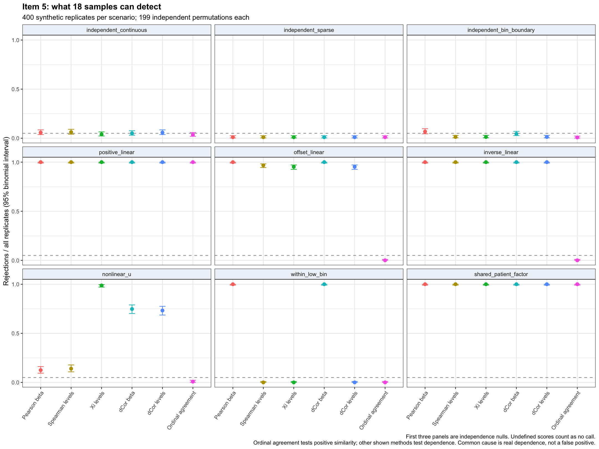

# Item 5: defined similarity scores, candidate evaluation and feasibility

Updated 2026-09-29. Requested task: **“Consider defining similarity scores or a new correlation.”**

## Decision

The supplied RRBS matrix supports a useful, explicit scoring procedure for
neighboring CpGs. The first proposed new coefficient, C*, does **not** establish
a methodological advance: it is a marginal rescaling of weighted kappa and
adds no information to its fixed-margin permutation test. Keep that negative
result rather than rename the same construction.

The continuation establishes why one scalar is insufficient for this task:
absolute agreement, dependence, and the amount of sample support are different
properties. A practical output is now available for **32,664 consecutive-row
pairs** in [the primary scorecard](Task43_PrimaryScorecard.csv.gz). It preserves
the required ten-level similarity, raw-beta similarity, signed correlations,
directional xi and support counts. These are defined and implemented scores;
**a novel, superior correlation remains unproven**.

## What was already done, and what was added

The earlier work was renumbered while this task was paused. Task 40 now concerns
OutlierMeth checks. The RRBS feasibility code and literature are Task 41; the
candidate is Task 42. Those completed results were inspected, and the Task 41
mathematical checks passed on resumption. They were not restarted.

Task 43 adds a fixed, known-truth simulation comparison, a reusable real-data
scorecard, an audit of information lost through binning, and corrections to
the interpretation in [report.md, section 5](../report.md). It does not reopen
the separate per-patient outlier project in `correlation for cg sites/`.

## The score definitions

For a pair of sites, let beta values `x_i,y_i` refer to the same patient. Use
only patients observed at both sites. The main scorecard requires all 18;
Task 41 separately reports overlap sensitivity at 6, 9, 12, 15 and 18.

Define `L(b)` by left-closed bins `[0,.1), [.1,.2), ..., [.9,1]`, numbered
1 through 10. Then

\[
S_{ordinal}=1-\frac{1}{9n}\sum_i |L(x_i)-L(y_i)|,
\qquad
S_{raw}=1-\frac{1}{n}\sum_i |x_i-y_i|.
\]

Both scores are in [0,1] and remain defined for constant profiles. One means
exact agreement in the representation being used. Neither score is a
probability, correlation, or significance measure. Their different numerical
values reflect different representations and scales. Raw MAE and RMSE are
reported alongside them so differences retain their beta-scale meaning.

Use signed raw Pearson and Spearman for linear/monotone association. Xi is a
complementary measure of potentially nonlinear dependence; the scorecard
contains both directions and their mean. Predictor ties are averaged exactly,
as allowed in [Chatterjee's original paper](https://arxiv.org/abs/1909.10140).
Undefined symmetric scores remain missing. In particular, a constant
predictor has directional tie-average xi of zero against a varying response,
but the reverse direction is undefined. Averaging does not repair that.

The scorecard also records the smaller of the two profiles' counts of samples
outside their most common level. Zero identifies a constant level profile;
one identifies a singleton profile. This is a support description, **not** a
biological classification or a threshold selected to improve results.

## What the real data can support

| Quantity | Observed value |
|---|---:|
| Input sites | 634,646 |
| Samples per site | 18 |
| Sites observed in all samples | 38,564 |
| Consecutive input-row pairs observed in all samples | 32,664 |
| Additional complete-site pairs that bridge missing rows | 5,899 |
| Main pairs with a constant raw profile | 1,940 (5.94%) |
| Main pairs with a constant ten-level profile | 7,938 (24.30%) |
| Both raw profiles vary, but binning makes at least one constant | **5,998 (18.36%)** |
| Main pairs with a singleton level profile and no constant level profile | 5,670 (17.36%) |

Sources: [input audit](Task41_InputAudit.json), [quantization audit](Task43_QuantizationAudit.csv),
[support counts](Task43_ScoreSupport.csv).

Thus the ten-level representation removes observable variation from a
substantial part of the eligible data. A new formula computed only on those
levels cannot recover information that binning discarded. The median absolute
raw Pearson correlation in the 5,998 affected pairs is 0.255; that is descriptive
association, not proof that the variation is biological. Read-depth noise
cannot be separated from biological variation using this ratio-only file.

“Consecutive” here means consecutive rows in the supplied file, not a verified
complete enumeration of reference-genome CpGs. Missing entries were not imputed,
and partial-overlap pairs were not silently treated as n=18. The hg38 coordinate
origin is preserved without independently asserting a zero/one-based convention.

## Why the candidate was rejected

For ordinal profiles, Task 42 defined observed paired absolute distance `D`,
mean distance over random patient matchings `D0`, and the minimum/maximum
distances attainable by sorted/reversed matching, `Dmin,Dmax`. It tested

\[
C^*=\frac{D_0-D}{\max(D_0-D_{min},D_{max}-D_0)}.
\]

This has conditional permutation mean zero and lies in [-1,1] when defined.
But `kappa_linear = (D0-D)/D0`, so C* is exactly that coefficient multiplied by
a margin-dependent constant. The maximum numerical equivalence error over
the real pairs is `5.11e-15`. All 383 evaluable pairs in the permutation pilot
gave the same p-values as paired L1 distance.

C* was undefined for 7,967 of 32,664 pairs. Among the 24,697 defined pairs,
23.46% attained +1. Removing one sample made it undefined for 83 of 383
evaluable pilot pairs. A unit score is therefore not strong evidence by itself.
See [candidate summary](Task42_CandidateSummary.csv),
[null diagnostic](Task42_CandidateNullDiagnostic.csv) and
[influence results](Task42_CandidateInfluence.csv).

An earlier piecewise denominator had an additional flaw: random rare profiles
could have a strongly nonzero mean. The corrected C* removes that flaw, but
does not create new within-pair testing information. Existing work on
[attainable agreement scaling](https://arxiv.org/abs/2006.12904) further limits
a novelty claim. The [literature note](Task41_Literature.md) gives the full
algebra and other direct precedents.

## Controlled benchmark added in this continuation

The protocol fixed n=18, nine generators, 400 independent replicates per
generator, alpha=.05 and 199 independent patient permutations per replicate.
All methods used the same permutations within a replicate. Nothing was tuned
to make a candidate win. The simulations use ratios; no read depth is invented.

Eleven statistics were compared: ordinal similarity, linear and quadratic
kappa, raw/level Pearson, raw/level Spearman, mean directional xi on levels,
raw/level ordinary distance correlation, and unbiased squared distance
covariance on levels. Established distance methods provide an important
nonlinear comparator; the latter estimator can be negative and was tested
without clipping or taking its absolute value. See
[Székely and Rizzo](https://arxiv.org/abs/1310.2926) and the
[method context](Task43_MethodContext.md).

Pearson and Spearman use absolute statistics to test both directions. Agreement
and kappa test positive correspondence. Therefore failure to reject inverse
dependence with an agreement test is consistent with its different target.
The permutation p-value is `(exceedances+1)/200`, including ties. Undefined
statistics are counted as no call in the table below; defined counts and
conditional rates are provided separately in the complete results.

| Scenario | Pearson raw | Spearman levels | Xi levels | dCor raw | dCor levels | Ordinal agreement |
|---|---:|---:|---:|---:|---:|---:|
| Independent continuous values | 5.75% | 6.25% | 4.00% | 5.00% | 5.75% | 3.50% |
| Independent sparse values | 1.00% | 1.00% | 1.00% | 1.00% | 1.00% | 1.00% |
| Independent values near a bin boundary | 6.75% | 1.25% | 1.25% | 4.50% | 1.25% | 0.75% |
| Positive linear relationship | 100% | 100% | 100% | 100% | 100% | 100% |
| Positive linear relationship with separated levels | 100% | 96.75% | 95.25% | 100% | 95.25% | 0% |
| Inverse linear relationship | 100% | 100% | 100% | 100% | 100% | 0% |
| Noisy U-shaped relationship | 12.50% | 14.00% | **98.75%** | 74.75% | 73.25% | 0.75% |
| Correlated variation entirely within level 1 | **100%** | Undefined | Undefined | **100%** | Undefined | 0% |
| Dependence generated by a shared patient factor | 100% | 100% | 100% | 100% | 100% | 100% |

Percentages are rejections among 400 generated replicates, not real-cohort
discovery rates. The first three rows are independence nulls. The last row is
**real marginal dependence from a common cause**, not a false-positive null.

The U-shaped scenario gives xi 395/400 detections, with an exact 95% binomial
interval of 97.11–99.59%. Level dCor gives 293/400, interval 68.63–77.53%.
This substantial difference is specific to the chosen generator. It does not
prove xi is universally best; published work also identifies alternatives
where xi has limited local power ([Shi, Drton and Han](https://arxiv.org/abs/2008.11619)).

Continuous-null rates of 3.5–6.25% across all eleven tests are compatible with
5% within their individual binomial intervals. Sparse and heavily tied cases
are conservative. The raw Pearson rate of 6.75% at the bin boundary has an
interval of 4.50–9.67%, so this run alone does not establish miscalibration.
These modest simulations cannot certify genome-wide error control or resolve
tiny method differences.



Complete outputs: [scenario definitions](Task43_ProtocolScenarios.csv),
[protocol](Task43_Protocol.json), [all summary statistics and intervals](Task43_BenchmarkSummary.csv),
[replicate results](Task43_BenchmarkReplicates.csv),
[paired method differences](Task43_PairedMethodDifferences.csv).

## A precise small-sample limitation

If each profile contains 17 low values and one high value, perfectly aligned
high values have exact random-alignment probability `1/18 = .0556`. Correlation
can equal one while the exact one-sided alignment test cannot reach .05.
With two shared high samples, the corresponding maximum-overlap probability
is `1/choose(18,2) = .00654`. This is a limitation of those marginal profiles,
not a claim that every analysis with 18 patients is impossible.

The unbiased distance-covariance kernel also vanishes for a singleton profile;
ordinary distance correlation is a different estimator and remains defined.
This established distinction is checked explicitly by the benchmark tests.

## What this means for accomplishing item 5

**Completed:** explicit similarity definitions; a tested candidate and a reason
to reject its new-correlation claim; all complete consecutive-row scores;
missingness, binning and sample-support audits; a known-truth benchmark showing
where the compared methods differ; and reproducible code with primary-source
context.

**Not established:** a novel superior estimator, sequencing-noise robustness,
direct biological coupling, or independent-cohort validation. The current file
lacks methylated/total counts and sample covariates needed to assess important
measurement and confounding questions.

The evidence supports keeping `S_ordinal` for the requested representation,
`S_raw` and raw correlation to preserve within-bin information, and xi as a
separate nonlinear-dependence summary with its support limitations. C* should
not be developed further as a new correlation. Any next candidate needs a
specific, demonstrated failure that these established methods do not already
address; renormalizing agreement or recovering information after it was
discarded is not that contribution. Additional scenarios used to develop a
candidate would need a separately fixed validation set.

## Reproduction and verification

From the repository root:

```sh
Rscript Scripts/Task41.Item5.Checks.R
Rscript Scripts/Task43.Item5.ControlledBenchmark.Sep29.2026.R
Rscript Scripts/Task43.Item5.ReportTables.Sep29.2026.R
```

The saved Task 41/42 outputs are prerequisites for the report tables. R 4.6.0
and installed `data.table`, `matrixStats`, `ggplot2` and `jsonlite` were used;
see [session information](Task43_SessionInfo.txt). The benchmark took about
69 seconds on this machine. Checks cover bin boundaries, constant handling,
exhaustive xi tie expectations, distance kernels, U-centering, cached versus
fresh independently permuted statistics, and output counts. An independent
code review found no correctness blocker; the [review](Task43_Review.md)
records statistical limitations. The standalone figure was visually inspected.

## Follow-up: Manhattan similarity and genomic context

The user's requested paper search is saved in the
[Manhattan and spatial prior-art review](Item5_Manhattan_Spatial_PriorArt.md).
It identifies direct methylation Manhattan precedents (MPCI and Methcon5),
spatial/correlation combinations (CoMeBack, SMART and A-clustering), and a
published exponential spatial-covariance model (Nustad et al.).

A separate [spatial-affinity pilot](Item5_Spatial_Pilot.md) implements a fixed
blend of raw Manhattan similarity and raw distance correlation, multiplied by
an exponential base-pair weight. On held-patient absolute agreement ranking,
the primary blend gave mean absolute difference 0.03990 versus 0.01635 for
Manhattan alone. This candidate therefore does not improve that endpoint.
The follow-up also saves raw-beta xi and dCor for all complete original-row
neighbor pairs; it does not revise the earlier simulation results or establish
novelty or biological validation.
