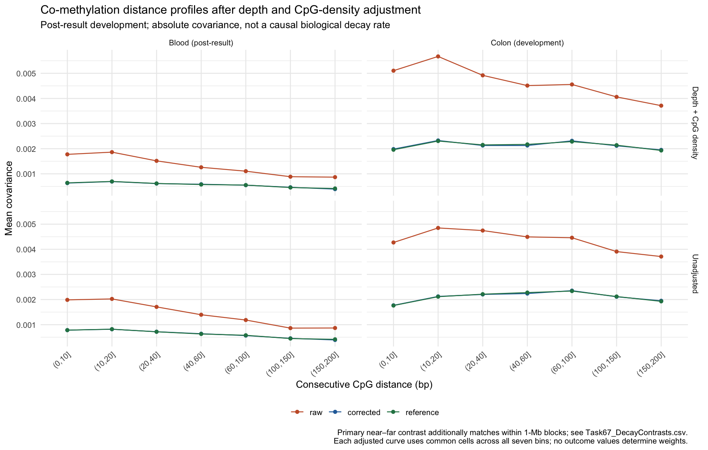

# Task 67: adjusted covariance decay, development analysis

Run on 2026-10-02. The colon and blood cohorts were already examined in
Tasks 55 and 59. This is post-result development, not another independent
validation. Plasma was not rerun, as requested.

## Endpoint changes from the initial draft

The initial draft is retained in `Task67_DecayEndpoint_Draft.md`. Its ratio
of far to near covariance has a noisy denominator, and a ratio of cross-
partition estimates is not an unbiased reference. The implemented primary
summary is therefore an **absolute contrast**: mean covariance at (0,10]
bp minus mean covariance at (150,200] bp. All three methods use the same
pair weights and eligible donors. The difference between the raw and
corrected contrast is the estimated technical contribution to that drop.

Matching uses no methylation levels, spreads, correlations or outcomes.
Cells are 1-Mb genomic block × mean depth in A [2,5), [5,10), [10,20),
[20,infinity) × reference CpG density [0,10), [10,30), [30,infinity).
Density counts CpGs within 500 bp of the pair midpoint, excluding the
focal two CpGs. A cell needs at least two pairs in each distance band.
Its target mass is proportional to the smaller band count, then its mass
is divided equally among the pairs in each band. The two bands consequently
have exactly the same cell distribution. This controls those coarse
features, not all tissue or sequence differences and not exact depth.

The primary calculation uses the existing modulo-25 donor-matrix caches.
Both its point and its intervals use **exactly that matched pair set**.
Weights and original donor eligibility masks remain fixed in bootstrap
draws; pairs with fewer than two resampled donor observations invalidate
the draw rather than silently disappearing. All 2,000 draws succeeded.

## Results

| Quantity | Colon | Blood |
|---|---|---|
| Matched near/far pairs | 280 / 72 | 776 / 187 |
| Genomic blocks / chromosomes | 35 / 14 | 82 / 20 |
| Raw near-minus-far covariance | 0.003706 | 0.0008982 |
| Corrected contrast | 0.001678 | 0.0002557 |
| Cross-partition reference contrast | 0.0009823 | 0.0004379 |
| Estimated technical contribution | 0.002027 | 0.0006424 |
| Exploratory 95% interval for technical contribution | [0.000981, 0.003178] | [0.000198, 0.001107] |
| Reduction relative to the raw point contrast | 54.7% | 71.5% |
| Change in squared contrast error against reference | -6.93e-6 | -1.79e-7 |
| Exploratory 95% interval for that error change | [-2.11e-5, 5.13e-6] | [-1.31e-6, 7.29e-7] |

The estimated technical contribution remains positive after this matching.
However, the contrast-error intervals cross zero in both cohorts, so this
does **not** establish a statistically superior decay estimate. Corrected
contrasts also have intervals crossing zero; that is not proof of a flat
biological relationship. The percentage reductions are descriptive point
ratios with no calibrated ratio intervals.

Common support is sparse. Of 54,077 near / 676 far cached colon pairs,
280 / 72 remain; in blood, 776 / 187 remain out of 74,136 / 1,295. These
results describe the matched subset. They cannot be generalized to all
CpGs just because full cohorts contain millions of pairs.

## Full distance profiles

The accompanying figure uses all eligible pairs for descriptive seven-bin
curves. The adjusted curves share a common distribution of depth × density
cells across all seven bins, requiring at least 20 pairs in every bin.
Each cell's mass is proportional to its smallest bin count. These curves
do **not** additionally match genomic blocks and have a different target
from the primary contrast above. No uncertainty bars are attached to them.



## Known-target interval checks

`Task67.DecayCalibration.R` simulates four settings with 40 genomic blocks,
donor-wide shifts and correlated pairs within blocks: flat latent decay
with 29 donors, genuine decay with 57, a highly methylated low-spread
52-donor setting at two reads per partition, and a zero shared-covariance
setting. There are 300 simulated datasets and 400 bootstrap draws per
dataset. The corrected population contrast and expected sampling-noise
contrast have **analytically known targets**, obtained from bounded latent
variables and enumeration of their eight joint states; targets are not
estimated from the tested simulations.

Recentered percentile coverage is 99.7–100% across these linear-contrast
checks. That is conservative in the tested settings, not accurate nominal
95% calibration or a guarantee for real data. The simulation conditions
on adequate, fixed per-partition coverage. It does not yet cover the sperm
cohort's random eligibility/missingness or calibrate the nonlinear squared-
error endpoint interval. That interval remains exploratory, and its failure
to exclude zero cannot be rescued by the linear-contrast checks.

## Interpretation and next gate

The data support a narrower observation: estimated shared-read sampling
noise contributes to the apparent near–far covariance difference even
after coarse depth/density and regional matching. Covariance is affected
by marginal biological variability as well as association, so this is not
a purified estimate of a molecular coupling length or causality.

For GSE165915, preserve the original covariance-error endpoint as primary.
Declare this absolute decay contrast as secondary before outcomes are
examined. Finalize support and uncertainty rules after counts-only
feasibility and missingness-aware simulations, then create the external
lock. These already examined cohorts cannot supply that new validation.

Reproduce with:

```sh
Rscript Scripts/Task67.DecayChecks.R
Rscript Scripts/Task67.DistanceDecay.Oct02.2026.R
Rscript Scripts/Task67.DecayCalibration.R
```

Outputs: `Task67_DecayContrasts.csv`, `Task67_CommonSupport.csv`,
`Task67_DistanceCurves.csv`, `Task67_DecayCalibration.csv`, the figure,
`Task67_RunManifest.json` and `Task67_CalibrationManifest.json`. The latter
records calibration hashes after execution; it is not a preregistration.
Existing frozen analyses are unchanged.
