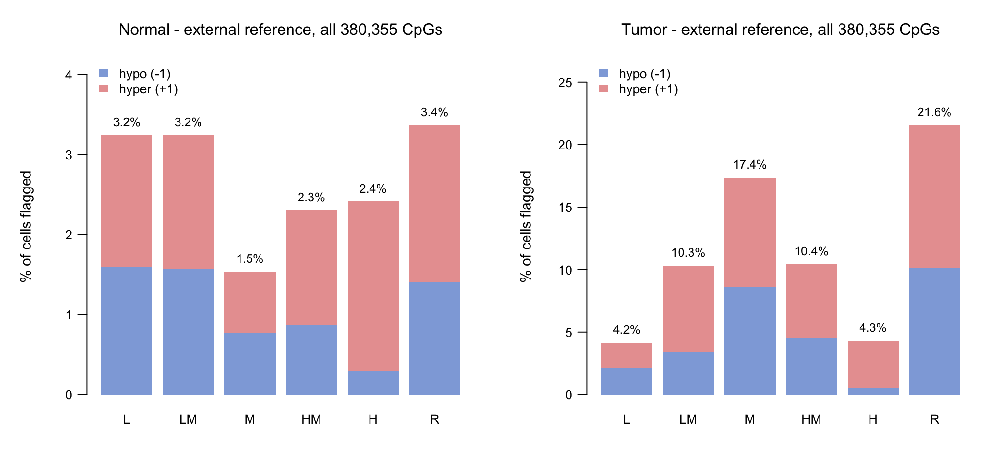
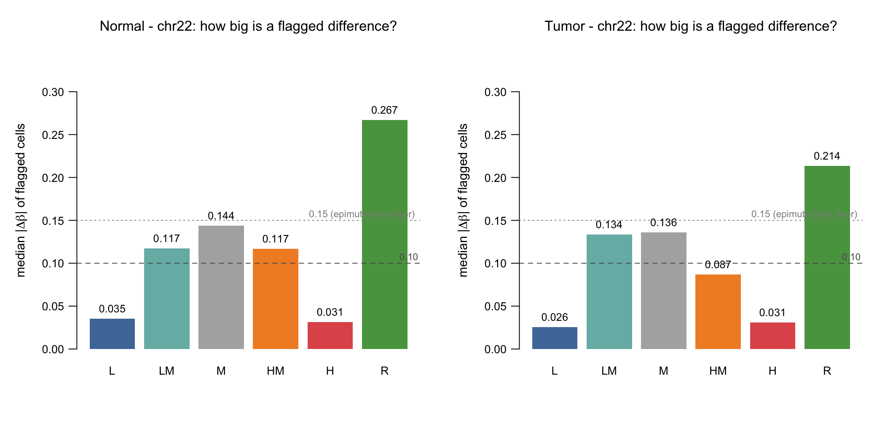
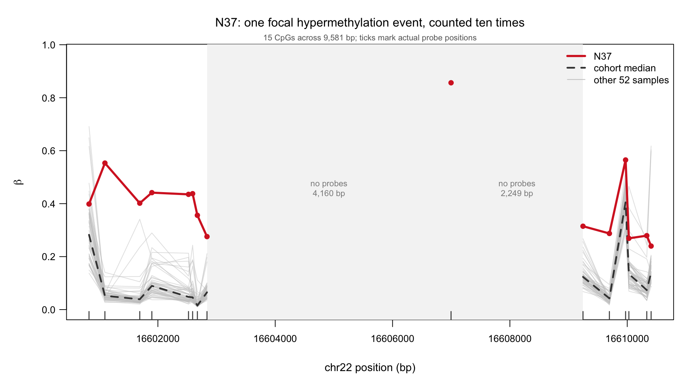
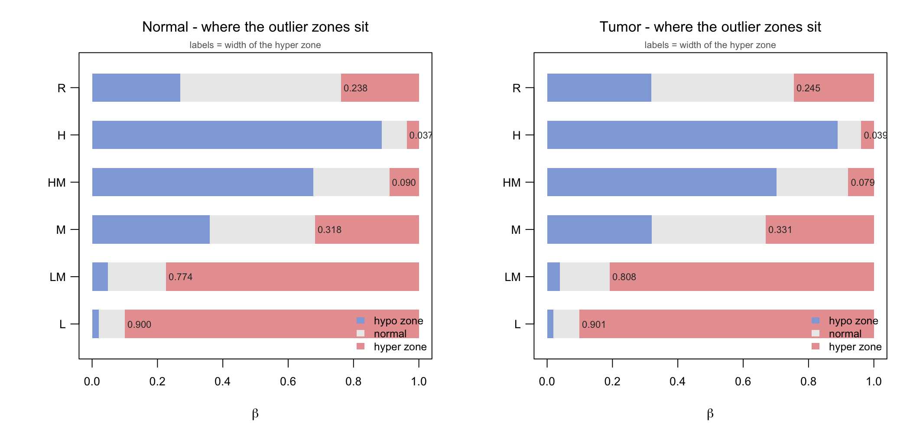
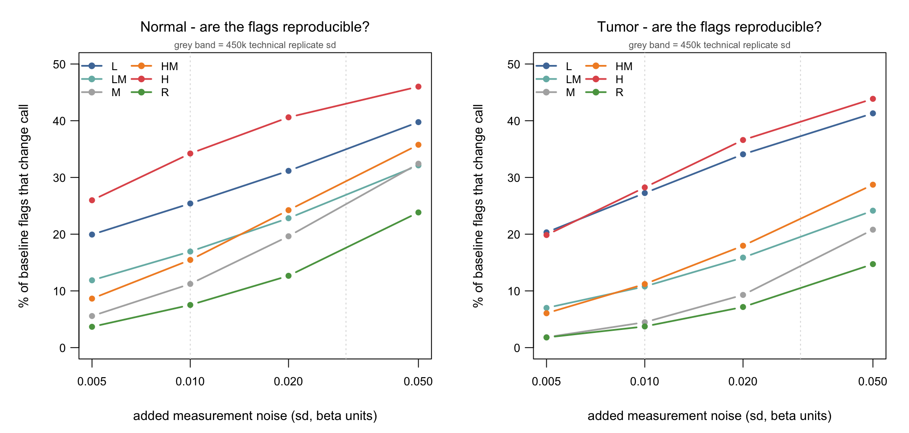

# Results

Findings for the weeks of 2026-08-24 and 2026-09-01, against the questions set
in the pre-meeting emails. Every number here is reproducible from a script in
`Scripts/` and a CSV in `Results/`; the source table for each is named beneath
it.

Cohort: TCGA-BRCA, 53 matched normal/tumour pairs, 380,355 CpGs on the
Illumina 450k array. Chromosome 22 carries 6,809 of them.

**Three flagging methods are compared throughout:**

| | how the threshold is set | |
|---|---|---|
| `bio` | state-aware rule: `L`/`LM` flag `+1` above the 99th percentile of the 53 values; `H`/`HM` flag `−1` below the 1st; `M`/`R` no rule | the rule proposed in the meetings |
| `self` | `referenceMeth()` on the same 53 samples | how the package was run in Tasks 10–15 |
| `ext` | the packaged `tcga` panel: **747** independent TCGA normal samples across 21 tissue types | how the package was **designed** to be run |

### Two things to fix in your head before reading any table

**The unit of analysis changes between sections.** Most apparent
contradictions dissolve once you check which one a table is counting:

| unit | what one row/count means | used in |
|---|---|---|
| **CpG** | one probe on the array, 380,355 total | §1 state counts, §8 |
| **cell** (sample × CpG) | one measurement — 53 per CpG | §1–3, §7 rates and % |
| **sample burden** | flags summed down one sample's column | §3, §4 |
| **event** | a run of ≥3 flagged CpGs within 1 kb, counted once | §4 |

A sample can have many *flags* and one *event*; a state can have a high *cell*
rate and few affected *CpGs*. Neither is a contradiction.

**The `ext` denominator differs from the `bio`/`self` denominator, and it
varies by state.** CpGs missing from the 747-sample panel come back all-NA,
so `ext` is scored on fewer cells at the same sites. Panel coverage is
systematically uneven:

| state | Normal: CpGs absent from panel | Tumour |
|---|---|---|
| `H` | 1.05% | 0.46% |
| `L` | 2.94% | 2.34% |
| `HM` | 3.30% | 3.38% |
| `R` | 8.91% | 8.27% |
| `LM` | **14.39%** | **11.47%** |
| `M` | **16.29%** | **24.82%** |

`Results/Task26_DenominatorAudit_*.csv`

Every percentage below is computed over *evaluable* cells for that method, so
each percentage is internally correct — but a raw **count** comparison between
`ext` and `bio` at `LM` or `M` sites compares different denominators. This is a
limitation of the comparison, not a bug, and it is why counts and
evaluable-cell totals are printed side by side throughout.

> **Read §8 first if you are short of time.** A typo was deleting the entire
> `R` methylation state from Tasks 10, 13 and 14 — 40.4% of tumour CpGs and
> 65.0% of tumour flag mass. It materially changes the previously reported
> tumour result and affects how every earlier table should be read.

> **Read the `ext` column.** At n = 53, `quantile(x, 0.99)` sits between the
> 52nd and 53rd order statistic, so exactly one sample can exceed it. `bio` and
> `self` therefore assign a fixed number of flags to every eligible CpG no
> matter what the data says, at every significance level from 0.01 to 0.00001.
> They are kept in every table below as a **negative control** — they show what
> "no signal" looks like — not as results.

---

## Answers in brief

| # | Question | Answer |
|---|---|---|
| 1 | Summarise chr22 by state | Done, both tissues, all 6 states — §1 |
| 2 | Any `+1` at `H`/`HM`? Any `−1` at `L`/`LM`? | **Yes, routinely.** Up to 6.3% of cells at tumour `H` sites — §2 |
| 3 | If non-zero, which sample, which site, why? | Three samples drive a third of them; the pattern is strongly consistent with threshold geometry, though biological and technical contributors are not yet excluded — §3 |
| 4 | Debug the sample summary, N37 on top | N37 is **41st of 53** chromosome-wide, so its window rank was an artifact. It carries one *candidate* focal event, pending probe QC — §4 |
| 5 | Explore genuinely adjacent CpGs | The original 100 sites span 5.17 Mb. A true 73 kb window changes the picture — §5 |
| 6 | Compare the state-aware rule with the external reference | Agreement is low once the shared-zero class is accounted for: κ = 0.21 (normal), 0.11 (tumour) — §6 |

Beyond the four questions, §7–§9 report why the flags behave this way, a
bug fix that changes a headline number, and a benchmark of seven alternatives.

The 2026-09-03 email added four more, answered in §10–§13:

| # | Question | Answer |
|---|---|---|
| 7 | Are the contrary flags from all CG sites, or 1–2? From 1–3 samples, or can every sample? | **Concentrated on sites, spread across samples.** Half the sites of a state carry all of them and the top two hold 57–86%; but 31 of 53 normal samples carry at least one — §10 |
| 8 | Try a "bio-stat" flag: the >96th percentile of the whole state pool (8 × 53 for `L`) | Works — it removes the n = 53 degeneracy and makes the flag rate exactly state-independent. Pool the *deviations*, not raw beta; 424 cells is too small a pool, use chr22 — §11 |
| 9 | Can the `ext` parameters be tuned to be less sensitive? | **No.** `p` has two usable settings on this 747-sample panel, and even the strictest leaves 100% of `H`-site hyper flags below \|Δβ\| = 0.10 — §12 |
| 10 | Does `OutlierMeth` report outlying *samples*? | No. It returns a CpG × sample matrix and nothing else — `LITERATURE.md` §2 |

**Correction carried through this document.** The external reference is the
`tcga` panel — 747 TCGA normal samples across 21 tissue types — not the
2,015-sample TCGA-GEO `all` panel described in earlier drafts. See §12.

---

## 1. Chromosome 22 summarised by state

The email's example — *"H, 11 CG sites"* — identifies the window exactly: the
first 100 chr22 CpGs by position, where `H` has 11 sites. Reproduced here in
full.

### Normal — 100 CpGs, chr22:11,915,060–17,085,407

| state | CpGs | method | −1 | 0 | +1 | % −1 | % 0 | % +1 |
|---|---|---|---|---|---|---|---|---|
| **L** | 8 | bio | 0 | 416 | 8 | 0.00 | 98.11 | 1.89 |
| | | self | 8 | 408 | 8 | 1.89 | 96.23 | 1.89 |
| | | **ext** | **8** | 359 | 4 | **2.16** | 96.77 | 1.08 |
| **LM** | 14 | bio | 0 | 728 | 14 | 0.00 | 98.11 | 1.89 |
| | | self | 14 | 714 | 14 | 1.89 | 96.23 | 1.89 |
| | | **ext** | **21** | 718 | 3 | **2.83** | 96.77 | 0.40 |
| **M** | 24 | bio | 0 | 1272 | 0 | 0.00 | 100.00 | 0.00 |
| | | self | 24 | 1224 | 24 | 1.89 | 96.23 | 1.89 |
| | | ext | 12 | 1241 | 19 | 0.94 | 97.56 | 1.49 |
| **HM** | 38 | bio | 38 | 1976 | 0 | 1.89 | 98.11 | 0.00 |
| | | self | 38 | 1938 | 38 | 1.89 | 96.23 | 1.89 |
| | | **ext** | 16 | 1952 | **46** | 0.79 | 96.92 | **2.28** |
| **H** | 11 | bio | 11 | 572 | 0 | 1.89 | 98.11 | 0.00 |
| | | self | 11 | 561 | 11 | 1.89 | 96.23 | 1.89 |
| | | **ext** | 2 | 571 | **10** | 0.34 | 97.94 | **1.72** |
| **R** | 5 | bio | 0 | 265 | 0 | 0.00 | 100.00 | 0.00 |
| | | self | 5 | 255 | 5 | 1.89 | 96.23 | 1.89 |
| | | ext | 5 | 256 | 4 | 1.89 | 96.60 | 1.51 |

`Results/Task20_Chr22_index100_StateSummary_Normal.csv`

Note every `self` row reads `1.89 / 96.23 / 1.89` — that is `1/53` and `51/53`,
to the digit, in all six states. This is the degeneracy, visible.

### Tumour — same 100 sites

`methy.state` is annotated per tissue, so these sites sit in different states in
tumour: `R` grows from 5 to 52 of the 100.

| state | CpGs | method | −1 | 0 | +1 | % −1 | % 0 | % +1 |
|---|---|---|---|---|---|---|---|---|
| **L** | 7 | ext | 4 | 307 | 7 | 1.26 | 96.54 | 2.20 |
| **LM** | 8 | ext | **29** | 362 | 33 | **6.84** | 85.38 | 7.78 |
| **M** | 13 | ext | 178 | 473 | 38 | 25.84 | 68.65 | 5.52 |
| **HM** | 19 | ext | 204 | 760 | **43** | 20.26 | 75.47 | **4.27** |
| **H** | **1** ⚠ | ext | 14 | 39 | 0 | 26.42 | 73.59 | 0.00 |
| **R** | 52 | ext | 551 | 2010 | 195 | 19.99 | 72.93 | 7.08 |

⚠ **Do not read the `H` row.** It is a single CpG, so "26.42%" means 14 flagged
cells at *one probe*. A percentage over n = 1 CpG estimates nothing. The `L`
(7 CpGs) and `LM` (8 CpGs) rows are also thin. This is a property of the window,
not of tumour biology: chr22's tumour annotation moves most of these sites into
`R`. The genome-wide tumour table in §8 — where `H` has 30,080 CpGs — is the one
to quote.

`Results/Task20_Chr22_index100_StateSummary_Tumor.csv` (bio/self rows omitted —
identical constants)

### Whole chromosome, and the whole genome

The 100-site window is small. The same summary over all 380,355 CpGs
(`Results/Task23_StateFlagTable_extref_*.csv`) is in §8, because producing it
required fixing a bug first.



---

## 2. Contrary flags: `+1` at `H`/`HM`, `−1` at `L`/`LM`

A `+1` at a site that is already high, or a `−1` at a site that is already low,
is a flag pointing where there is no room. The email asked whether any exist.

**Yes — in every state, in both tissues, at every scale tested.**

| tissue | state | contrary flag | count | of cells | rate |
|---|---|---|---|---|---|
| Normal | `L` | `−1` | 39 | 2,120 | 1.84% |
| Normal | `LM` | `−1` | 5 | 530 | 0.94% |
| Normal | `HM` | `+1` | 9 | 1,113 | 0.81% |
| Normal | `H` | `+1` | 16 | 848 | 1.89% |
| Tumour | `L` | `−1` | 52 | 2,014 | 2.58% |
| Tumour | `LM` | `−1` | 33 | 583 | **5.66%** |
| Tumour | `HM` | `+1` | 47 | 1,060 | **4.43%** |
| Tumour | `H` | `+1` | 40 | 636 | **6.29%** |

External reference, 100-CpG tight window (§5).
`Results/Task20_Chr22_tight100_ContraryCounts_*.csv`

The `bio` rule returns **zero** in every row — it can only assign `+1` at
`L`/`LM` and `−1` at `H`/`HM`, so a contrary flag is impossible by
construction. That is worth stating explicitly, because it means the `bio`
column in this table is not evidence of anything.

---

## 3. Which sample, which site, and why

### Which samples

Three samples supply about a third of all state-contrary external flags on
chr22, and they are the same three in both tissues.

| sample | contrary `L` | `LM` | `HM` | `H` | **total** | all ext flags | % contrary |
|---|---|---|---|---|---|---|---|
| N17 | 101 | 18 | 195 | 96 | **410** | 1,250 | 32.8% |
| N15 | 84 | 13 | 192 | 92 | **381** | 1,297 | 29.4% |
| N14 | 118 | 18 | 149 | 84 | **369** | 1,039 | 35.5% |
| N48 | 153 | 93 | 72 | 38 | 356 | 496 | 71.8% |
| N31 | 48 | 37 | 147 | 69 | 301 | 405 | 74.3% |
| N27 | 98 | 15 | 60 | 91 | 264 | 278 | **95.0%** |

`Results/Task21_Chr22_ContraryDrivers_Normal.csv`

N15, N17 and N14 also lead the burden ranking at every scale in both tissues,
and their chr22 external burden tracks their genome-wide burden at Spearman
0.761 (normal) / 0.843 (tumour). **This is a whole-sample property, not a
chr22 story** — global hypomethylation, tumour purity, or a technical batch
effect. None has been tested yet; that is the first item in `plan.md`.

Note the last column. For the lower-burden samples, *almost every* external
flag is state-contrary — 95% for N27. That is the opposite of what a
biological reading would predict.

### Which sites

The 39 contrary `L`-state flags in the tight window fall on 23 distinct CpGs
across 20 samples. Of the 69 contrary external flags there:

- **0** lie in a CpG island
- **0** have an SNV within 10 bp
- **2** are also Tukey 3×IQR outliers within this cohort
- **48** are isolated — no flagged neighbour within 1 kb

`Results/Task20_Chr22_tight100_ContraryDetail_Normal.csv` (private — carries
per-sample beta at named positions)

So the usual technical explanations do not apply. Which leaves the question:

### Why

Because the difference being flagged is negligible. Measuring
`|β − cohort median|` for every chr22 cell the external reference flagged:

| state | tissue | flags | median \|Δβ\| | under 0.05 | under 0.10 |
|---|---|---|---|---|---|
| `H` | Normal | 1,283 | **0.031** | 78.3% | **97.7%** |
| `L` | Normal | 3,774 | **0.035** | 52.7% | **82.2%** |
| `LM` | Normal | 1,495 | 0.117 | 27.0% | 44.2% |
| `HM` | Normal | 2,019 | 0.117 | 7.1% | 39.3% |
| `M` | Normal | 513 | 0.144 | 0.0% | 19.3% |
| `R` | Normal | 564 | **0.267** | 0.0% | **3.6%** |
| `H` | Tumour | 1,473 | 0.031 | 82.6% | 97.4% |
| `L` | Tumour | 3,822 | 0.026 | 59.5% | 87.3% |
| `R` | Tumour | 19,170 | 0.214 | 6.7% | 17.6% |

`Results/Task21_Chr22_ExtFlagMagnitude.csv`

**98% of the flags at `H` sites move beta by less than 0.10.** At `R` sites the
median flag moves it by 0.21–0.27. Many flags therefore carry small absolute
beta differences, raising the concern that statistical flagging is not tracking
biologically meaningful effect sizes — and the pattern falls exactly where the
methylation state predicts. §7 gives a mechanism consistent with this.

**This is no longer a chr22-only result.** Repeated over all 380,355 CpGs:

| state | tissue | CpGs | flags | median \|Δβ\| | under 0.10 |
|---|---|---|---|---|---|
| `H` | Normal | 61,845 | 78,259 | 0.031 | **96.97%** |
| `L` | Normal | 104,540 | 174,567 | 0.042 | 81.53% |
| `R` | Normal | 23,455 | 38,131 | **0.269** | 3.68% |
| `H` | Tumour | 30,080 | 68,114 | 0.028 | **96.16%** |
| `L` | Tumour | 76,106 | 163,788 | 0.031 | 85.21% |
| `R` | Tumour | 153,479 | 1,608,650 | **0.213** | 19.92% |

`Results/Task26_GenomeWideMagnitude.csv`

The chr22 figures (97.7% / 82.2% / 3.6%) reproduce genome-wide to within about
a percentage point.



---

## 4. Debugging the sample summary — N37

N37 topped the Task 17 summary with 11 of 71 biological flags, ~8× the uniform
expectation of 1.34. Widening the denominator settles it:

| scale | CpGs | method | flags | expected | **rank of 53** |
|---|---|---|---|---|---|
| index100 | 100 | `bio` | 11 | 1.34 | **1** |
| index100 | 100 | `ext` | 1 | 2.83 | 30 |
| tight100 | 100 | `bio` | 1 | 1.66 | 17 |
| chr22 | 6,809 | `bio` | 24 | 108.3 | **41** |
| chr22 | 6,809 | `ext` | 114 | 182.0 | 25 |

`Results/Task21_Chr22_SampleBurden_Normal.csv`

Three independent reasons N37 came out on top, none of them "N37 is an outlier
sample":

1. **The window is not representative.** Chromosome-wide, N37 carries less than
   a quarter of its expected burden. Spearman between index100 rank and chr22
   rank is only 0.344.
2. **The external reference does not see it** — 1 flag, rank 30.
3. **Ten flags are one event.** They collapse to 3 runs at a 1 kb gap; the
   largest holds 7 CpGs.

### But the event itself is real

This corrects the Task 19 write-up, which implied N37 had merely won a series
of narrow maxima. It had not:

| cgID | position | state | N37 β | cohort median | 2nd highest | **margin** | gap |
|---|---|---|---|---|---|---|---|
| cg01836687 | 16,601,097 | LM | 0.553 | 0.052 | 0.141 | **0.413** | — |
| cg26822097 | 16,601,691 | LM | 0.402 | 0.039 | 0.341 | 0.061 | 594 |
| cg12431879 | 16,601,897 | LM | 0.442 | 0.089 | 0.289 | 0.152 | 206 |
| cg00332021 | 16,602,522 | LM | 0.435 | 0.048 | 0.213 | 0.222 | 625 |
| cg00816224 | 16,602,592 | LM | 0.438 | 0.046 | 0.243 | 0.195 | 70 |
| cg15554678 | 16,602,673 | LM | 0.356 | 0.015 | 0.111 | 0.245 | 81 |
| cg23572163 | 16,602,837 | LM | 0.276 | 0.065 | 0.211 | 0.064 | 164 |

`Results/Task21_Chr22_N37_Cluster_Normal.csv` (private)

Seven consecutive `LM` CpGs across 1,740 bp, N37 at β 0.276–0.553 against a
cohort median of 0.015–0.089, median margin 0.195 over the next-highest sample.
**This is a candidate focal epimutation pattern, pending probe masking and
technical-quality checks** — the caveat below is not a formality. What can be
said without qualification is narrower: the per-sample summary counted one
contiguous run seven times.

The correct unit is the event, not the flag — following the `epimutacions`
definition of ≥3 outlier CpGs within 1 kb. By that unit N37 has one.



> **Caveat before this is called biology.** chr22:16.6 Mb (hg19) is
> pericentromeric on the acrocentric short arm — repetitive and poorly mapped.
> A seven-probe run there is also what a cross-hybridisation artifact looks
> like. Standard 450k probe masking (Chen 2013 / Zhou 2017) has **not** been
> applied to this project yet. That is `plan.md` step 2.

---

## 5. Genuinely adjacent CpG sites

The email asked for sites *close to each other*. The 100 CpGs used in Tasks
17–19 are consecutive **by index**, not by distance:

| window | span | median gap | largest gap | pairs within 1 kb |
|---|---|---|---|---|
| `index100` (Tasks 17–19) | **5,170,347 bp** | 512 bp | **3,410,179 bp** | 61 / 99 |
| `tight100` (new) | **73,399 bp** | 187 bp | 13,823 bp | 80 / 99 |

`Results/Task20_Chr22_WindowComparison.csv`

`tight100` is the 100 consecutive chr22 CpGs with the smallest genomic span,
found by sliding a 100-probe window across all 6,809: chr22:50,459,312–50,532,711.
It also has a better state mix (`L` 40, `HM` 21, `H` 16, `LM` 11, `M` 9, `R` 3).

Both windows are analysed side by side in every Task 20 output, so the legacy
result stays reproducible and the difference is visible. The window choice
matters: N37 drops from rank 1 to rank 17 between them, and the Spearman
correlation of sample ranks against the chromosome-wide truth improves from
0.344 to 0.553.

---

## 6. The state-aware rule vs the external reference

Raw percent agreement is meaningless here — all four flag matrices are >95%
zeros, so any two of them "agree" ~96% of the time by sharing blanks. (This is
why the Task 17 agreement figure of 44–53 out of 53 was uninformative.) Two
honest metrics instead:

- **agreement | flagged** — of cells flagged by *at least one* method, the
  fraction where both gave the same value
- **Cohen's κ** — chance-corrected

| tissue | pair | flagged by either | agreed | agreement \| flagged | κ |
|---|---|---|---|---|---|
| Normal | `bio` vs `ext` | 172 | 21 | **12.2%** | **0.206** |
| Normal | `self` vs `ext` | 235 | 63 | 26.8% | 0.411 |
| Normal | `bio` vs `self` | 200 | 88 | 44.0% | 0.604 |
| Tumour | `bio` vs `ext` | 415 | 28 | **6.8%** | **0.109** |
| Tumour | `self` vs `ext` | 455 | 99 | 21.8% | 0.333 |

`Results/Task20_Chr22_tight100_Concordance_*.csv`

By state (Normal, `bio` vs `ext`): κ = 0.26 at `H`, 0.17 at `HM`, 0.17 at `L`,
0.35 at `LM`, and 0.00 at `R` — where `bio` has no rule at all.

Agreement is low once the large shared-zero class is accounted for
(κ ≈ 0.21 normal, 0.11 tumour), indicating that the two methods
**operationalise "outlier" differently** rather than offering two views of one
underlying set.

A caution on κ itself: under this much class imbalance (>95% zeros) κ is
sensitive to the marginal flag rates, so it should be read alongside the
`agreement | flagged` column rather than on its own. Both point the same way
here, which is why the conclusion stands.

---

## 7. Why the flags behave this way

Task 22 reconstructs the external thresholds from the flag matrix itself:
`flagMeth` sets `+1` iff `β > P`, so `max(β | unflagged) ≤ P < min(β | flagged)`
brackets `P` per CpG.

> This doubles as a correctness check on the whole pipeline. Across 13,618
> CpG × tissue combinations there were **zero** cases where a flagged sample's
> beta sat inside the unflagged range — so the Task 13 flag/beta join is in
> register.

### The outlier zones are wildly asymmetric

| state | `P` | hyper zone (1−P) | hypo zone (N−0) | gap between the two samples straddling `P` |
|---|---|---|---|---|
| `L` | 0.100 | 0.900 | **0.021** | 0.024 |
| `LM` | 0.226 | 0.774 | 0.049 | 0.057 |
| `M` | 0.682 | 0.318 | 0.360 | 0.028 |
| `HM` | 0.910 | **0.090** | 0.677 | 0.013 |
| `H` | 0.963 | **0.037** | 0.886 | **0.003** |
| `R` | 0.762 | 0.238 | 0.269 | 0.052 |

Normal, chr22 medians. `Results/Task22_Chr22_ThresholdGeometry_Normal.csv`

At an `H` site the hyper-outlier zone is 0.037 of the beta scale and the hypo
zone is 0.886 — a 24-fold asymmetry — yet **87.8% of observed flags are `+1`**.

The arithmetic spelled out, because this ratio is the whole argument. There are
1,283 flags at `H` sites in Normal:

```
hyper flags = 1,283 x 87.8% = 1,126   in a zone 0.037 wide
hypo  flags = 1,283 x 12.2% =   157   in a zone 0.886 wide

flags per unit of beta space
  hyper = 1,126 / 0.037 = 30,363
  hypo  =   157 / 0.886 =    177        ratio = 171x
```

Per unit of room available, flags are **171× denser in the direction the state
already constrains**. At `L` sites the same calculation gives 44×. A rule with
no directional preference would give a ratio near 1.



*Reading Figure 3:* each row is one methylation state. The coloured bands are
**threshold zones, not data** — blue is the range of beta in which a sample
would be called hypo, red the range for hyper, grey the range treated as
normal. The number beside each red band is its width. Compare the red band at
`H` (0.037 wide) against the one at `L` (0.900): a sample at an `H` site has
almost nowhere to go before it is called an outlier.

### The decision boundary sits inside the array's noise

At `H` sites the two samples straddling the threshold are **0.003 apart**. 450k
technical replicate SD is roughly 0.01–0.03. Re-flagging after adding N(0, sd)
noise, 20 replicates per level (Normal, 9,648 baseline flags):

| noise sd | flags lost | flags gained | % baseline lost | changed calls ÷ baseline |
|---|---|---|---|---|
| 0.005 | 1,487 | 6,833 | 15.4% | 0.86 |
| **0.010** | **2,062** | **13,467** | **21.4%** | **1.61** |
| 0.020 | 2,693 | 23,187 | 27.9% | 2.68 |
| 0.050 | 3,485 | 43,726 | 36.1% | 4.91 |

`Results/Task22_Chr22_FlagStability_Normal.csv`

At sd = 0.01 — inside the array's own error — **more calls change than there
were flags to begin with.** Instability tracks the compressed states exactly:
`H` 34.2%, `L` 25.4%, `HM` 15.5%, against `R` 7.5%.



### It is not an `OutlierMeth` bug

Tukey's 3×IQR — a different statistic, and the one behind the `outliers.coef2/3`
columns already sitting unused in the source files — has a state bias too, a
*different* one:

| state | median cohort IQR | percentile rate | Tukey rate | Jaccard |
|---|---|---|---|---|
| `L` | **0.008** | 3.30% | 3.39% | 0.294 |
| `LM` | 0.052 | 3.38% | 2.61% | 0.242 |
| `M` | 0.081 | 1.41% | 0.29% | 0.065 |
| `HM` | 0.068 | 2.37% | 0.40% | 0.076 |
| `H` | 0.023 | 2.69% | 0.77% | 0.050 |
| `R` | 0.157 | 3.91% | 0.71% | 0.101 |

`Results/Task22_Chr22_PercentileVsTukey_Normal.csv`

The reason is the second column: the IQR that Tukey thresholds on is *itself* a
function of the state.

**The defect follows from applying any scale-free dispersion threshold to beta
values that are squeezed against their own bounds** — not from one package.
Unpacking that: beta is trapped between 0 and 1, so the spread of values is much
smaller near 0 and near 1 than in the middle (the formal term is
*heteroscedasticity* — the variance is not constant across the range; Du et al.
2010). Both rules here are *scale-free*: they ask "which samples are in the
extreme tail?" and never "by how much?". At a site where the whole cohort sits
within 0.03 of each other, something is always in the tail.

### What was ruled out

- **Panel miscalibration.** If the BRCA cohort simply sat outside the
  panel's range, many samples per CpG would flag. At most 11 of 53
  do; zero CpGs reach 50%; 0% of normal flags sit in such CpGs. These are
  genuine per-sample calls.
- **A join or register error.** Zero bracket violations, as above.

---

## 8. Bug fix: the `R` state was being deleted

`Task10`, `Task13.FlagBias` and `Task14.FlagBias` all declared:

```r
state_order <- c("L", "LM", "M", "HM", "H", "Rc")   # the data has "R"
```

The subsequent `tab[ord, ]` kept only matched states, so **every `R`-state CpG
was silently dropped**. All three scripts are now fixed and carry a guard that
stops on any state present in the data but missing from `state_order`.

The bug was worse than the earlier review estimated — it was framed as "40% of
tumour CpGs", but by flag mass:

| reference | tissue | `R` CpGs | % of CpGs | `R` flags | % of **all flags** |
|---|---|---|---|---|---|
| self | Normal | 23,455 | 6.2% | 46,910 | 6.2% |
| self | Tumour | 153,479 | 40.4% | 306,958 | 40.4% |
| ext | Normal | 23,455 | 6.2% | 38,131 | 7.4% |
| **ext** | **Tumour** | **153,479** | **40.4%** | **1,608,650** | **65.0%** |

`Results/Task23_RStateImpact.csv`

Task 14's tumour external-reference table — the strongest result in the project
— was built on **35% of the flag mass**. Corrected, genome-wide:

| state | CpGs | % −1 | % 0 | % +1 | **% flagged** |
|---|---|---|---|---|---|
| `L` | 76,106 | 2.08 | 95.84 | 2.08 | 4.16 |
| `LM` | 40,824 | 3.41 | 89.66 | 6.93 | 10.34 |
| `M` | 5,436 | 8.61 | 82.63 | 8.76 | 17.37 |
| `HM` | 74,430 | 4.55 | 89.56 | 5.89 | 10.44 |
| `H` | 30,080 | 0.50 | 95.71 | 3.79 | 4.29 |
| **`R`** | **153,479** | **10.14** | **78.44** | **11.42** | **21.56** |

Tumour, external reference, all 380,355 CpGs.
`Results/Task23_StateFlagTable_extref_Tumor.csv`

The five original rows reproduce to the digit, which validates the
regeneration. The missing row turns out to have **the highest flag rate of any
state** — and, from §3, the largest effect sizes. The category that was deleted
is the one carrying the signal.

---

## 9. What to use instead — benchmark of seven methods

Seven outlier definitions on the same chr22 cells. **Every method is calibrated
by bisection to the external reference's own flag rate**, so stability and
state-dependence are compared at equal sensitivity — an uncalibrated comparison
of outlier methods is close to meaningless.

- `stability` — Jaccard between the flag set on clean data and on data
  perturbed by N(0, 0.01), the array's technical error. Self-derived methods
  are **fully recomputed** on the perturbed data, so threshold re-estimation is
  included. Higher is better.
- `state rate ratio` — max ÷ min flag rate across the six states; 1 = perfect
  state-independence.
- `mag H÷R` — median |Δβ| of flags at `H` sites ÷ the same at `R` sites; 1 =
  equally large effects regardless of state.
- `% trivial` — share of flags with |Δβ| < 0.10.

### Normal

| method | rate | **stability** | state rate ratio | mag H÷R | % trivial |
|---|---|---|---|---|---|
| **`ext` + 0.10 floor** | 1.09 | **0.899** | 62.0 | **0.492** | **0.0** |
| `tukey.iqr` | 2.82 | 0.583 | 4.53 | 0.135 | 59.5 |
| `mad.beta` | 2.82 | 0.558 | 5.54 | 0.128 | 60.0 |
| `loo.quantile` | 3.77 | 0.397 | 1.00 † | 0.145 | 58.5 |
| `beta.fit` | 2.82 | 0.390 | 1.75 | 0.151 | 45.4 |
| `ext.percentile` (current) | 2.82 | 0.328 | 2.78 | 0.117 | 61.5 |
| `mad.mvalue` | 2.82 | **0.308** | 3.22 | 0.140 | 52.6 |

### Tumour

| method | rate | **stability** | state rate ratio | mag H÷R | % trivial |
|---|---|---|---|---|---|
| **`ext` + 0.10 floor** | 6.61 | **0.953** | 128.3 | **0.463** | **0.0** |
| `ext.percentile` (current) | 10.78 | 0.648 | 4.65 | 0.144 | 38.7 |
| `mad.beta` | 10.78 | 0.628 | 1.96 | 0.117 | 48.6 |
| `tukey.iqr` | 10.78 | 0.600 | 1.37 | 0.115 | 50.5 |
| `beta.fit` | 10.78 | 0.578 | 1.71 | 0.117 | 40.9 |
| `loo.quantile` | 10.78 | 0.522 | 1.01 † | 0.116 | 52.0 |
| `mad.mvalue` | 10.78 | **0.474** | 1.24 | 0.114 | 49.1 |

`Results/Task24_MethodBenchmark_Scores.csv`

### Three conclusions, one of which reverses an earlier recommendation

**1. An absolute-difference floor is the strongest candidate tested so far,
but the cut-off is not yet justified.** Two follow-ups were run specifically to
stress-test this claim, and both matter.

*Is 0.10 special?* No. It was chosen after seeing these data, so it was swept
across 0.05–0.20 (`Results/Task26_FloorSensitivity_*.csv`, Normal):

| floor | flag rate | flags retained | stability | mag H÷R | % trivial |
|---|---|---|---|---|---|
| 0 (current) | 2.67% | 100% | 0.328 | 0.117 | 61.5 |
| 0.05 | 1.69% | 63.3% | 0.748 | 0.243 | 39.1 |
| **0.10** | 1.03% | 38.6% | 0.794 | 0.492 | 0.0 |
| 0.15 | 0.54% | 20.2% | 0.820 | 0.526 | 0.0 |
| 0.20 | 0.31% | 11.6% | 0.868 | — | 0.0 |

Stability rises **monotonically**, so this curve cannot select a value — pushed
far enough the floor flags almost nothing and scores nearly perfectly. At 0.20
no `H`-state flag survives at all, which is why the magnitude ratio is
undefined. **The cut-off has to be justified biologically — as the smallest
beta difference worth calling real on this platform — not read off this table.**
`epimutacions` uses 0.15; the gap between 0.10 and 0.15 is small here (0.794 vs
0.820), so either is defensible and 0.10 is not privileged.

*Is the advantage just a lower flag rate?* No. Every competing method was
re-tuned **down** to the floor's exact rate and re-scored
(`Results/Task26_RateMatchedStability_*.csv`):

| method (Normal, all at 1.031%) | stability | mag H÷R | % trivial |
|---|---|---|---|
| **ext + 0.10 floor** | **0.794** | **0.492** | **0.0** |
| tukey.iqr | 0.474 | 0.172 | 53.9 |
| mad.beta | 0.424 | 0.158 | 53.3 |
| beta.fit | 0.221 | 0.164 | 40.2 |
| mad.mvalue | 0.191 | 0.157 | 46.7 |

Tumour behaves the same way (floor 0.907, mad.beta 0.680, tukey 0.654,
beta.fit 0.537, mad.mvalue 0.429). At identical sensitivity the floor still
leads by a wide margin, so the advantage is a property of the method rather
than of its flag rate. That was a genuine weakness in the first draft of this
section; it is now tested rather than merely caveated.

Its state-rate ratio *rises* to 55–117, which is the intended effect rather
than a defect: it removes nearly all `H`/`L` flags because those flags had no
magnitude. Whether that is correct depends on accepting that sites with little
room genuinely have fewer real outliers — which §7 argues but does not prove.

**2. M-values do not help — they make it worse.** This reverses the
recommendation in the earlier README and plan. `mad.mvalue` is the **least**
stable method tested in both tissues (0.308 / 0.474), below the same rule on
raw beta (0.558 / 0.628). The logit transform stabilises *variance* but
amplifies *noise* at the extremes: a 0.01 shift near β = 0.97 is a large move
in M-space. Since the extremes are exactly where the problem lives, the
standard textbook correction is the wrong tool here. Recorded as a negative
result.

**3. † `loo.quantile`'s perfect state-rate ratio is degeneracy, not virtue.**
It flags a fixed count per CpG by construction, so its rate cannot vary by
state. Read it alongside its stability (0.40 / 0.52), which is poor.

---

## 10. Where the contrary flags come from — sites, or samples?

*(2026-09-03 email, Analysis item 1.)* The email listed the four contrary cells
in the 100-CpG normal window and asked whether they come "from all CG sites, or
from 1 or 2 CG sites", and whether "from 1 or 2-3 samples, or if every sample
can have a chance."

The counts reproduce exactly, with one difference: the `H` `+1` cell is **10**
flags across **11** `H` sites, not 11 flags.

### Normal — the four cells

| state | dir | flags | sites in state | sites carrying ≥1 | most at one site | top-2 sites hold | samples carrying ≥1 | most in one sample | top-3 samples hold |
|---|---|---|---|---|---|---|---|---|---|
| `L` | `−1` | 8 | 8 | **4** | 4 | **75%** | 8 / 53 | 1 | 37.5% |
| `LM` | `−1` | 21 | 14 | **8** | 8 | 57.1% | 14 / 53 | 3 | 33.3% |
| `H` | `+1` | 10 | 11 | **4** | 4 | **70%** | 9 / 53 | 2 | 40.0% |
| `HM` | `+1` | 46 | 38 | 23 | 5 | 21.7% | 19 / 53 | 7 | 34.8% |

### Tumour — the same cells, tumour annotation

| state | dir | flags | sites in state | sites carrying ≥1 | most at one site | top-2 sites hold | samples carrying ≥1 | most in one sample | top-3 samples hold |
|---|---|---|---|---|---|---|---|---|---|
| `L` | `−1` | 4 | 7 | 3 | 2 | 75% | 4 / 53 | 1 | 75% |
| `LM` | `−1` | 29 | 8 | **4** | **19** | **86.2%** | 22 / 53 | 2 | 20.7% |
| `H` | `+1` | 0 | 1 | — | — | — | — | — | — |
| `HM` | `+1` | 43 | 19 | 12 | 10 | 39.5% | 22 / 53 | 5 | 30.2% |

`Results/Task29_Window100_ContraryDecomposition.csv`

### The answer

**Concentrated on sites. Spread across samples.**

Half the sites of a state carry every contrary flag it has, and the top two
sites hold 57–86% of them. A Monte Carlo test against uniform allocation
rejects at `p = 0.0008` (Normal `LM`) and `p < 0.0001` (Tumour `LM`). One
probe, `cg15668074` (chr22:15,721,335), carries **19 of the 29** tumour `LM`
`−1` flags on its own.

Samples show the opposite pattern. No sample holds more than 1–7 flags in any
one cell, 8–23 of 53 samples appear, and the concentration test is
non-significant in five of the seven testable cells. Pooling all four contrary
cells:

| tissue | contrary flags | samples carrying ≥1 | top 3 hold | Gini | leaders |
|---|---|---|---|---|---|
| Normal | 85 | **31 / 53** | 27.1% (uniform: 5.7%) | 0.63 | N15 = 9, N48 = 9, N17 = 5 |
| Tumour | 76 | **37 / 53** | 19.7% | 0.55 | T33 = 6, T36 = 5, T14 = 4 |

So: a *majority* of samples can and do carry a contrary flag. The lead that
N15 and N17 hold is real but small — 27% against an expectation of 6% — and
N48 is new here, not one of the N15/N17/N14 trio §3 identified. This is a mild
sample gradient, not a two-sample story.

### Why those sites, then?

Not because they are biologically interesting. `flagMeth` sets `+1` iff
`beta > P`, where `P` comes from the external panel and knows nothing about
this cohort, so the number of samples a site flags is decided by how far `P`
sits from this cohort's own distribution at that site. Reconstructing `P` and
`N` per site from the flag matrix (the Task 22 bracket) and measuring that
distance in cohort-MAD units, against the contrary-flag count, within state:

| tissue | state | sites | contrary flags | Spearman ρ | p | median distance to the contrary-direction threshold |
|---|---|---|---|---|---|---|
| Normal | `L` | 4 | 8 | **−0.949** | 0.051 | 1.48 MAD |
| Normal | `LM` | 8 | 21 | **−0.736** | 0.038 | 1.17 MAD |
| Normal | `HM` | 23 | 46 | −0.398 | 0.060 | 1.94 MAD |
| Normal | `H` | 4 | 10 | −0.600 | 0.400 | 1.12 MAD |
| Tumour | `LM` | 4 | 29 | −0.800 | 0.200 | 1.03 MAD |
| Tumour | `HM` | 12 | 43 | −0.120 | 0.710 | 1.03 MAD |

`Results/Task29_Window100_SiteThresholdGeometry.csv` *(private — per-site
reconstructed thresholds bound individual beta values at identified positions)*

Every correlation is negative: the sites that concentrate the contrary flags
are the sites where the external threshold happens to sit closest to this
cohort's median. The median distance is **1.0–1.9 MAD** — at an `L` site the
panel's 1st-percentile hypo threshold sits about one and a half cohort-MADs
below the median, so of course some samples fall past it. Small n means only
two of the six correlations reach p < 0.05 individually, but all six point the
same way.

### And the magnitudes are still trivial

| tissue | cell | median \|Δβ\| | under 0.10 |
|---|---|---|---|
| Normal | `L` `−1` | **0.016** | **100%** |
| Normal | `H` `+1` | **0.025** | **100%** |
| Normal | `LM` `−1` | 0.040 | 90.5% |
| Normal | `HM` `+1` | 0.086 | 54.3% |
| Tumour | `L` `−1` | **0.010** | **100%** |
| Tumour | `HM` `+1` | 0.074 | 76.7% |

Compare the *concordant* direction at the same sites, chr22-wide (Task 31):
`L` `+1` has median \|Δβ\| 0.090 against `L` `−1` at 0.014, a 6.6× difference;
`H` `−1` 0.078 against `H` `+1` 0.028, 2.8×. The direction the state permits
carries real shifts; the direction it forbids carries noise.

**Practical consequence.** Probe masking (`plan.md` §2) will remove *some* of
these, since a handful of sites carry most of them — but masking cannot be the
whole answer, because the sites are concentrated for a geometric reason that
will simply relocate to the next-closest threshold once they are removed.

---

## 11. One threshold per state instead of one per CpG

*(2026-09-03 email, Analysis item 2: "For the L (8 CG sites), bio-stat flag
based on all 'L' state, that is, >96% percentile of 8×53, similarly for other
states.")*

This is a direct answer to the n = 53 degeneracy. An empirical quantile over 53
values is an order statistic; a quantile over 8 × 53 = 424 values, or over
2,211 × 53 = 117,183 on all of chr22, is an estimate. Two ways to pool were
tested:

| | pooled quantity | the threshold is |
|---|---|---|
| `bio.stat.abs` | raw beta | one absolute beta value per state — the email's version literally |
| `bio.stat.dev` | `beta −` that site's cohort median | one **effect size** per state |

Only the informative tail is used per state, matching `bio`: `L`/`LM` upper,
`H`/`HM` lower, `M`/`R` both.

### The window, at q = 0.96 (Normal)

| state | pool | threshold | flags | sites ≥1 | samples ≥1 | median \|Δβ\| |
|---|---|---|---|---|---|---|
| `L` | 424 | β > 0.0841 | 17 | 4 / 8 | 10 / 53 | 0.047 |
| `LM` | 742 | β > 0.3442 | 30 | 9 / 14 | 18 / 53 | 0.106 |
| `M` | 1,272 | β < 0.3300 or > 0.7340 | 52 | 15 / 24 | 35 / 53 | 0.080 |
| `HM` | 2,014 | β < 0.6160 | 81 | 10 / 38 | 48 / 53 | 0.080 |
| `H` | 583 | β < 0.8771 | 24 | 8 / 11 | 17 / 53 | 0.058 |
| `R` | 265 | β < 0.1020 or > 0.8884 | 12 | 3 / 5 | 11 / 53 | 0.138 |

`Results/Task30_StatePooled_Thresholds.csv`

**The window pool is too small.** The `L` threshold estimated from 424 cells is
0.0841; from all 117,183 chr22 `L` cells it is 0.1020 — 18% higher. Report the
chr22 figure, not the window one.

### The two variants behave very differently

States are wide: `L` spans β 0.005–0.10. Under the **absolute** rule the top of
the pooled tail is dominated by whichever *sites* sit highest within the state,
so it flags whole sites rather than unusual samples. Under the **deviation**
rule each site's own level is removed first, so it asks the intended question.
chr22, q = 0.96, both at exactly 4.00% by construction:

| tissue | variant | sites carrying a flag | median \|Δβ\| | under 0.10 | stability | state-rate ratio |
|---|---|---|---|---|---|---|
| Normal | `bio.stat.abs` | 40.9% | 0.079 | 63.9% | 0.823 | 1.00 |
| Normal | `bio.stat.dev` | **63.5%** | **0.137** | **38.6%** | 0.804 | 1.00 |
| Tumour | `bio.stat.abs` | 41.7% | 0.078 | 60.4% | 0.779 | 1.00 |
| Tumour | `bio.stat.dev` | **89.8%**\* | **0.242** | **30.2%** | **0.865** | 1.00 |

\* at q = 0.90; 63.5% at q = 0.96. `Results/Task30_StatePooled_QSweep.csv`,
`Results/Task30_StatePooled_Scores.csv`

The clearest case is tumour `R` sites, where the absolute rule gives a median
\|Δβ\| of **0.016** and the deviation rule **0.465** on the same cells — the
absolute thresholds (0.025, 0.942) are so extreme that the only cells clearing
them are at sites whose median already sits near a boundary.

### What it fixes, and what it does not

**Fixes the rate bias completely.** `state.rate.ratio` is 1.00 by construction
— every state gets exactly `1 − q` of its cells flagged. That is also the
limitation: the rule *cannot* discover that one state genuinely has more
outliers than another, because it assumes it does not.

**Fixes the degeneracy.** No fixed count per CpG. Sites can have zero flags
(36–59% of them do) and sites can have many.

**Does not fix the magnitude problem at `H` and `L`.** At q = 0.96 on chr22
Normal, the deviation threshold is 0.037 at `L` and 0.046 at `H` — because
that is genuinely what the 96th percentile of those states' deviations is.
Flags there still average \|Δβ\| ≈ 0.06. A state-pooled percentile is still a
percentile; only an absolute floor removes trivial flags.

### The number the email asked for

The `bio.stat.dev` thresholds *are* per-state calibrated versions of the
proposed `|beta − median| > 0.05` floor. Read off the 96th percentile of each
state's own deviation distribution (chr22 Normal):

| state | `L` | `LM` | `M` | `HM` | `H` | `R` |
|---|---|---|---|---|---|---|
| calibrated floor | **0.037** | 0.142 | 0.147 / 0.179 | 0.125 | **0.046** | 0.306 / 0.341 |

So **0.05 is about right for `L` and `H`, and three to seven times too lenient
for everything else.** A single constant cannot be right everywhere, which is
why Task 32 tests a per-state floor against a constant one.

---

## 12. What the parameters can and cannot do

*(2026-09-03 email, Literature item 1: "check to see if you can adjust the
'parameter' setting". Full detail in `LITERATURE.md`.)*

`OutlierMeth` has two knobs: `reference` (4 panels) and `p` (4 levels). Neither
helps.

### First, a correction

**The reference used here is `tcga` — 747 normal samples across 21 tissue
types, not the 2,015-sample TCGA-GEO panel this repo has been describing.**
2,015 / 25 tissue types is the `all` panel. The code loads `tcga.rda` and calls
`flagMeth(beta, reference = tcga, p = 0.01)`. Corrected throughout on
2026-09-03. It matters:

### `p` has two usable settings, not four

`referenceMeth()` uses R's default type-7 quantile, so level `1 − p` sits at
position `h = (n − 1)(1 − p) + 1` in the sorted reference. Level `p` is a real
tail estimate only when `n ≳ 1/p + 2`. At n = 747:

| `p` | position in the sorted 747 | rank from top | expected n above |
|---|---|---|---|
| 0.01 | 739.54 | 8th | 7.5 |
| 0.001 | 746.25 | 1st–2nd | 0.75 |
| 0.0001 | 746.93 | 1st–2nd | 0.075 |
| 0.00001 | 746.99 | 1st–2nd | 0.007 |

The three strictest levels all land between the two most extreme reference
samples; `p = 0.0001` and `p = 0.00001` differ by 6% of one inter-sample gap.
`p = 0.0001` would need n ≥ 10,002 and the largest packaged panel is 2,015, so
no panel `OutlierMeth` ships supports its own two strictest settings.

**This is the same order-statistic degeneracy the README documents at n = 53,
and it reaches the external arm too.** `Results/Task31_PLevelResolution.csv`

### And tightening `p` would not help anyway

Thresholds are monotone in `p`, so the flag set is **nested**: any stricter
setting keeps a prefix of each CpG's current flags ordered by beta. That means
the entire family of outcomes reachable by tuning `p` can be enumerated from
the `p = 0.01` matrix — keep the top *r* per CpG per direction, for
*r* = 5, 3, 2, 1. *r* = 1 is the strictest setting that still flags anything.

chr22 Normal, the two contrary cells:

| cell | setting | flags | median \|Δβ\| | under 0.10 | surviving a 0.10 floor |
|---|---|---|---|---|---|
| `H` `+1` | `p = 0.01` as run | 1,127 | 0.028 | **100.0%** | **0** |
| `H` `+1` | strictest (*r* = 1) | 536 | 0.031 | **100.0%** | **0** |
| `L` `−1` | `p = 0.01` as run | 1,894 | 0.014 | 99.8% | 4 |
| `L` `−1` | strictest (*r* = 1) | 977 | 0.013 | 99.8% | **2** |

against `R` `+1`, where the same tightening does what it should:
0.314 → 0.342 median \|Δβ\|, 309 → 136 flags surviving the floor.
`Results/Task31_PEnvelope.csv`

The ceiling is structural. At `H` sites the median cohort beta is 0.934, so
there is 0.066 of beta space above it, and only **0.24%** of all `H` cells sit
≥ 0.10 from their site median (`L`: 0.79%; `R`: 36.6%).
`Results/Task31_EffectSizeCeiling.csv`

**`p` changes how many flags you get. It never changes how big they are.**

### The package's own effect-size function points the wrong way

`deltMeth` returns `beta − threshold` — a magnitude floor is one comparison
away from something already computed. `relMeth` divides that by the remaining
head-room `1 − P`, which at `H` sites is 0.037. Measured on chr22 Normal:

| state | median `P` | `1 − P` | median `deltMeth` | median `relMeth` | inflation |
|---|---|---|---|---|---|
| `L` | 0.100 | 0.900 | 0.024 | 0.027 | 1× |
| `M` | 0.673 | 0.327 | 0.024 | 0.069 | 3× |
| `HM` | 0.907 | 0.093 | 0.010 | 0.110 | **11×** |
| `H` | 0.963 | **0.037** | **0.0022** | **0.075** | **34×** |
| `R` | 0.750 | 0.250 | 0.040 | 0.205 | 5× |

`Results/Task31_DeltVsRelMeth.csv`

A user reaching for `relMeth` to get an interpretable effect size gets the
opposite: the flags whose direction the state made inevitable come back looking
like the largest effects in the dataset.

---

## 13. Five candidate fixes, scored

Task 24 benchmarked seven *existing* outlier definitions. This adds the
candidates that follow from §10–§12, all tuned by bisection to the same flag
rate as `ext` + a 0.10 floor (Normal 1.031%, Tumour 6.272%), following the
rate-matching Task 26 Part C established.

### First: the noise level is now measured, not assumed

Every stability figure in this project perturbs beta by `N(0, 0.01)` because
that is what the literature says about 450k technical error. Adjacent CpG pairs
replace that with a measurement. For probes *i*, *j* within 100 bp, the
systematic difference between the two positions is constant across samples and
drops out of `sd(beta_i − beta_j)`; what remains bounds technical noise from
above at `sd / sqrt(2)`.

| pair set | Normal σ̂ (p10) | Normal σ̂ (median) | Tumour σ̂ (p10) | Tumour σ̂ (median) |
|---|---|---|---|---|
| ≤ 50 bp | 0.0025 | 0.0129 | 0.0030 | 0.0158 |
| **≤ 100 bp** | **0.0029** | **0.0142** | **0.0036** | **0.0171** |
| ≤ 200 bp | 0.0032 | 0.0149 | 0.0038 | 0.0179 |
| ≤ 500 bp | 0.0035 | 0.0154 | 0.0043 | 0.0187 |
| > 1 Mb (null) | 0.0081 | 0.0224 | 0.0107 | 0.0789 |

`Results/Task32_MeasuredNoise.csv`

Close pairs are 2.8× (Normal) to 3.0× (Tumour) tighter than distant pairs at
the 10th percentile, so the bound is measuring probe-level noise rather than
biology. **The assumed sd = 0.01 sits between the tightest decile (0.003) and
the median (0.014) of the measured bound — i.e. inside the measured range, and
conservative relative to the median.** The stability results in §7 and Task 24
stand. *(Caveat: this bounds technical noise plus any genuine divergence
between neighbouring probes, so it is an upper bound, and the p10 is the
tightest available rather than an unbiased estimate.)*

### The scores

Normal, chr22, all at 1.031% except where noted:

| method | rate | stability | state-rate ratio | median \|Δβ\| | trivial | **contrary** |
|---|---|---|---|---|---|---|
| `ext.floor.med.0.10` | 1.031 | **0.793** | 54.8 | 0.153 | **0%** | 21.0% |
| `ext.floor.state` | 1.031 | 0.781 | **3.3** | 0.122 | 38.6% | 14.9% |
| `bio.stat.dev` | 1.031 | 0.779 | **1.0** | **0.197** | 18.2% | **0%** |
| `ext.floor.med.0.05` | 1.693 † | 0.748 | 5.9 | 0.115 | 39.1% | 28.0% |
| `ext.delt` | 1.031 | 0.649 | 11.2 | 0.137 | 25.5% | 17.2% |
| `ext.floor.noise` | 1.031 | 0.584 | 8.8 | 0.109 | 43.9% | 15.7% |
| `mad.beta` | 1.031 | 0.429 | 33.7 | 0.096 | 53.3% | 0.1% |
| `ext.percentile` | 2.673 † | 0.329 | 2.7 | 0.078 | 61.5% | **52.9%** |
| `asin.mad` | 1.031 | 0.326 | 13.4 | 0.097 | 52.7% | 2.5% |
| `mad.mvalue` | 1.031 | 0.192 | 7.6 | 0.105 | 46.7% | 12.1% |

Tumour, all at 6.272% except where noted:

| method | rate | stability | state-rate ratio | median \|Δβ\| | trivial | **contrary** |
|---|---|---|---|---|---|---|
| `ext.floor.med.0.10` | 6.272 | **0.907** | 117.0 | 0.224 | **0%** | 6.5% |
| `ext.delt` | 6.272 | 0.880 | 34.6 | 0.210 | 16.9% | 9.4% |
| `ext.floor.med.0.05` | 8.130 † | 0.871 | 20.1 | 0.180 | 22.9% | 14.6% |
| `bio.stat.dev` | 6.272 | 0.833 | **1.0** | 0.199 | 32.1% | **0%** |
| `ext.floor.state` | 6.272 | 0.751 | 3.0 | 0.224 | 23.2% | 21.8% |
| `ext.floor.noise` | 6.272 | 0.705 | 5.0 | 0.224 | 18.1% | 15.1% |
| `mad.beta` | 6.272 | 0.678 | 5.5 | 0.121 | 44.2% | 1.3% |
| `ext.percentile` | 10.222 † | 0.648 | 4.3 | 0.138 | 38.7% | 27.0% |
| `asin.mad` | 6.271 | 0.546 | 2.8 | 0.120 | 44.7% | 5.8% |
| `mad.mvalue` | 6.272 | 0.429 | 1.8 | 0.118 | 45.3% | 14.6% |

† not rate-matched — reported at its own, *higher*, rate. Both still lose to
`ext.floor.med.0.10`, so the constant-0.10 floor's advantage is not a
sensitivity artifact. `Results/Task32_ImprovedMethodScores.csv`

`pct.contrary` is new: the share of a method's flags that run against the site's
state (`−1` at `L`/`LM`, `+1` at `H`/`HM`). It is the email's own diagnostic,
scored directly.

### Five conclusions

**1. Over half of the external reference's Normal flags are contrary.** 52.9%
of `ext.percentile` flags on chr22 Normal run against the site's state; 27.0%
in tumour. A 0.10 floor cuts that to 21.0% / 6.5%. That single number is
probably the clearest statement of the problem the project has.

**2. The plain constant floor still wins.** `|beta − cohort median| ≥ 0.10` on
top of the external flag is the most stable rule tested in both tissues, and
the only one with zero trivial flags by construction. The elaborations do not
beat it.

**3. `0.05` is measurably worse than `0.10`, even with a rate advantage.**
The email's proposed 0.05 gives 0.748 / 0.871 stability at a *higher* flag rate
than 0.10's 0.793 / 0.907, and leaves 39% / 23% of flags below \|Δβ\| = 0.10.
If one constant has to be picked, 0.10 is better; `epimutacions` uses 0.15.

**4. The state-pooled deviation rule is the best reference-free option, by a
lot.** `bio.stat.dev` reaches 0.779 / 0.833 stability against `mad.beta`'s
0.429 / 0.678 at the same rate, has a state-rate ratio of 1.0, the highest
median \|Δβ\| in Normal, and produces **zero** contrary flags by construction.
It needs no external panel, no `tcga.rda`, and no assumption that a pan-tissue
reference applies to breast. This is the professor's own suggestion and it is
the strongest thing in the table after the constant floor.

**5. A noise-scaled floor is worse than a constant one — a negative result.**
`ext.floor.noise` sets each state's floor at `k ×` the measured σ from Part A.
Because σ is smallest exactly where the state is most compressed (`L`: 0.0025),
the floor there ends up at 0.023 and keeps the trivial flags. Stability 0.584 /
0.705, below every floor variant. **Noise scaling and interpretability are
different requirements**: a 0.02 shift at an `L` site may be many σ, and it is
still not a finding.

### The transform story, resolved

Task 24 found M-values the *least* stable method tested, reversing the textbook
advice, and blamed the logit for amplifying noise at the extremes. That was a
hypothesis. Adding the **angular transform** `φ = 2·asin(√β)` — variance-
stabilising like the logit, but bounded on [0, π] and so far less aggressive —
tests it. Amplification is measured directly as the median `|dT/dβ|` at the
cells each method actually flags, normalised to raw beta:

| tissue | transform | amplification at flags | stability | contrary flags |
|---|---|---|---|---|
| Normal | raw beta | 1.00 | **0.429** | **0.1%** |
| Normal | arcsine | 1.48 | 0.326 | 2.5% |
| Normal | M-value | 3.25 | **0.192** | **12.1%** |
| Tumour | raw beta | 1.00 | **0.678** | **1.3%** |
| Tumour | arcsine | 1.37 | 0.546 | 5.8% |
| Tumour | M-value | 3.13 | **0.429** | **14.6%** |

Monotone in both tissues, on both metrics. **The more a transform stretches the
extremes, the less reproducible its flags and the more of them run against the
state.** The hypothesis holds, and the practical conclusion is not "use a
gentler transform" — arcsine is gentler and still loses to raw beta — but
"do not transform; add a magnitude requirement instead."


---

## Files

| | |
|---|---|
| `Scripts/Task20.*` | tight window, concordance (κ), annotated contrary flags |
| `Scripts/Task21.*` | burden across three scales, contrary drivers, magnitude |
| `Scripts/Task22.*` | threshold geometry, stability, percentile vs Tukey |
| `Scripts/Task23.*` | corrected state tables, `R` restored |
| `Scripts/Task24.*` | seven-method benchmark |
| `Scripts/Task25.*` | figures |
| `Scripts/Task26.*` | review response: denominators, floor sensitivity, rate-matched stability, genome-wide magnitude |
| `Scripts/Task27.*` | the complete 100-CpG sheet, site by site |
| `Scripts/Task28.*` | window-selection test: minimise span or maximum gap |
| `Scripts/Task29.*` | contrary-flag decomposition over sites and samples; per-site threshold geometry |
| `Scripts/Task30.*` | state-pooled ("bio-stat") thresholds, absolute and deviation variants |
| `Scripts/Task31.*` | parameter headroom: effect-size ceiling, `p` envelope, deltMeth vs relMeth, `p`-level resolution |
| `Scripts/Task32.*` | measured noise from adjacent probes; five candidate fixes scored |
| `Results/Fig1–5*.png` | the five figures above |
| `Slurm/Task2*.sbatch` | batch equivalents |

Each script has a matching `.Rout` console transcript. Tables naming a sample
*and* a genomic position are individual-level and stay private — see
`CLASSIFICATION.md`.

`README.md` has the project overview and method; `plan.md` has the ordered next
steps; `REVIEW.md` has the code-level findings; `LITERATURE.md` has the review of
the `OutlierMeth` reference panels, Borealis and epimutacions.

---

## Next, in order

1. **Probe masking** (Chen 2013 / Zhou 2017). Blocks any biological claim,
   including N37's event.
2. ~~**Confirm §7 genome-wide.**~~ Partly done — Task 26 repeats the magnitude
   analysis over all 380,355 CpGs and the chr22 figures reproduce to within a
   percentage point. The threshold-geometry and stability results in §7 are
   still chr22-only and remain to be extended.
3. ~~**Measure the noise instead of assuming it.**~~ Done — §13 estimates it
   from adjacent-probe pairs. The assumed sd = 0.01 sits inside the measured
   range (p10 0.003, median 0.014), so §7's stability results stand. Technical
   replicates, if any exist upstream of de-identification, would still be a
   tighter estimate.
4. **Test what drives N15/N17/N14.** Batch, detection-p, cell composition,
   purity. Until excluded, per-sample burden cannot be interpreted.
5. **Decide between the constant floor and the state-pooled rule.** §13 makes
   `ext` + 0.10 the best rule overall and `bio.stat.dev` the best rule that
   needs no external panel. They answer different questions and the paper
   probably wants both — one as the recommendation, one as the demonstration
   that the external panel is not load-bearing.
